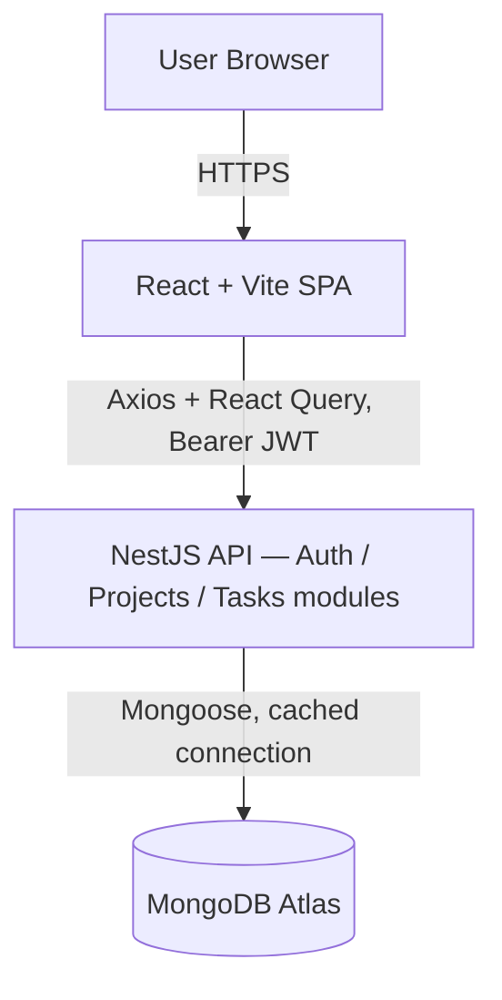

<div align="center">

# TeamBoard — Project Summary

**One-page version of everything in `/docs`.** Read this to explain the build;
read `/docs/00-10` for the full detail on any one piece.

</div>

---

## 1. What it is, in one paragraph

TeamBoard is a work-management app: sign up, create projects, break each project
into tasks, drag tasks across **To Do → In Progress → Done**. It's built for the
Heunets full-stack assessment (`instructions.md`), which explicitly says it's
graded on *"technical decisions, code organization, and system design thinking —
not just the number of features completed."* Everything below is written with
that grading lens in mind — every non-obvious choice has a stated reason.

**Stack:** React + Vite + TypeScript (frontend), NestJS + TypeScript (backend),
MongoDB Atlas (database), a shared TypeScript-types package linking the two.

---

## 2. The one-sentence architecture pitch

> *"It's a modular monolith — one deployable app today, but built with the exact
> internal seams (per-feature modules, thin controllers, fat services, typed
> contracts) that let any module become its own microservice later without
> touching the rest of the code."*



The frontend has **zero business logic** — it just displays state and calls the
API. The API owns every rule and every write. MongoDB is the single source of
truth. That's the whole system in one sentence.

---

## 3. The decisions worth being able to explain (ADRs, simplified)

If asked "why did you do X," these are the answers:

| Decision | Plain-English reason |
|---|---|
| **MongoDB Atlas, not swapped for Postgres/Supabase** | The brief named MongoDB explicitly. Don't spend your "architectural freedom" arguing with the one fixed requirement — spend it on things that matter. |
| **Referenced documents, not embedded** (`Project.owner`, `Task.project` are IDs, not nested objects) | Keeps `projects` and `tasks` as independent, queryable collections. This is what makes "could evolve into microservices" literally true instead of just a claim — an embedded document can't be split into two databases later; a reference can. |
| **Built JWT auth from scratch** (bcrypt + Passport + guards), no Auth0/Clerk | This is the single most-scrutinized part of the assessment. Using a hosted auth provider would have hidden exactly the skill being tested. |
| **JWT in `localStorage`, not a cookie** | Frontend and backend are different origins/ports, so a Bearer token is the simplest thing that's actually correct. Trade-off stated honestly: it's technically readable by injected scripts (XSS surface); an `httpOnly` cookie would be the hardening move if they ever shared a domain. |
| **Thin controllers, fat services** | Controllers only translate HTTP ↔ DTO ↔ service call. Every rule (ownership checks, password hashing, cascades) lives in a `*.service.ts`. This is *why* a module can later become a standalone microservice — the logic is already isolated behind one clean interface. |
| **`@teamboard/shared` package** | One TypeScript file (`shared/src/index.ts`) defines every type that crosses the wire — `User`, `Project`, `Task`, `TaskStatus`, all the request/response shapes. Both the backend DTOs and the frontend API calls import from it. If the contract drifts, it's a compile error, not a bug found in production. |
| **Config validated at startup (Joi)** | If `MONGODB_URI` or `JWT_SECRET` is missing, the app refuses to boot with a clear message, instead of failing mysteriously later. "Fail fast, fail loud." |
| **Serverless backend on Vercel, with a named Plan B** | Cheap, git-push deploys, one dashboard for both apps. Trade-off: cold starts, no long-running processes. If that's ever a problem, the *same* NestJS code redeploys to Railway/Render as an always-on service — just a different `npm run start:prod` target. |

---

## 4. What was actually built (milestone by milestone)

Each of these has its own detailed doc in `/docs` — this is the condensed version.

| # | Milestone | What it delivered |
|---|---|---|
| **00** | Architecture | The decisions above, the design system, the repo map — the plan everything else follows. |
| **01** | Repo setup | npm-workspaces monorepo (`shared` / `backend` / `frontend`), env-var validation, `.env.example` files, nothing secret ever committed. |
| **02** | Database schemas | Three Mongoose collections — `users`, `projects`, `tasks` — with proper indexes, referenced (not embedded) relationships, and `toJSON` transforms that guarantee a password hash can never leak into an API response. |
| **03** | Auth module | `POST /auth/signup`, `POST /auth/login`, `GET /auth/me`. bcrypt-hashed passwords, JWT issuance, a Passport guard. Login gives the same error for "wrong password" and "no such account" — never reveals which accounts exist. |
| **04** | Projects & Tasks modules | Full CRUD, every single query scoped to the logged-in user's id (pulled from the verified JWT, never trusted from the request body). One shared "do you own this?" check reused by both modules. Deleting a project cascades its tasks. |
| **05** | Frontend scaffold | Vite + React + TypeScript, React Router, TanStack Query for all server data, the "Ink & Patina" design system (brand colors/fonts wired into Tailwind), feature-first folder structure mirroring the backend. |
| **06** | Frontend auth flow | Login/signup forms (react-hook-form + zod validation), token storage + auto-attach to every request, a `ProtectedRoute` wrapper, session restored on page refresh. |
| **07** | Projects/Tasks UI | The actual product: a project grid, and inside each project a three-column task board. Moving a task between columns is optimistic (updates instantly, rolls back on failure) and animates smoothly between columns. |
| **08** | Testing + Postman | 8 Jest unit tests targeting the two highest-risk behaviors (password handling, ownership enforcement) — the kind of bug that would be a security hole, not a typo. Plus a self-chaining Postman collection covering every endpoint. |
| **09** | Deployment | Documented (not yet executed) procedure for two Vercel projects (frontend static, backend serverless) + Atlas. Explains the one detail that separates "works in a demo" from "works in production": reusing the database connection across serverless invocations instead of opening a new one every request. |
| **10** | README + demo script | The client-facing README, plus a scripted 5-minute walkthrough for presenting the build. |

---

## 5. What's been added since the original 10 milestones

After the initial build, four rounds of real user feedback and one feature request were handled:

- **Session-aware navigation** — the homepage navbar now knows whether you're logged in (shows your avatar + a shortcut to your projects) instead of always showing "Sign in."
- **Consistent logo behavior** — the TeamBoard logo always links back to the homepage, everywhere it appears.
- **A shared `UserMenu` dropdown** (avatar → Dashboard / Settings / Sign out) used in both the marketing navbar and the in-app top bar — this also fixed a real mobile bug where the sign-out button had a `hidden` CSS class that hid it below the `sm` breakpoint entirely.
- **A Settings page** — change your display name, upload a profile photo, or delete your account. Email is intentionally **not** editable (enforced server-side — even a hand-crafted request trying to sneak an `email` field into the update payload gets rejected outright, not silently ignored). Deleting an account requires re-entering your password and cascades every project/task you own.
- **Cloudinary avatar uploads** — photos upload directly from the browser to Cloudinary using an *unsigned* upload preset, so no API secret ever has to live in the frontend or backend. Verified with a real upload against the live account.

Also fixed along the way: a handful of dependency-version mismatches (NestJS packages had drifted across two major versions, `multer` had a known DoS CVE — both resolved via a root-level `overrides` pin), and several local `EADDRINUSE`/CORS port-collision issues that were dev-environment noise, not application bugs.

---

## 6. How it's organized on disk

```
teamboard/
├── backend/      NestJS API — one folder per feature (auth, users, projects, tasks)
├── frontend/     Vite + React SPA — same "one folder per feature" idea
├── shared/       @teamboard/shared — the types both sides import
├── docs/         00-10, the detailed version of everything in this file
└── README.md     setup instructions + the architecture/trade-offs write-up
```

Inside `backend/src/<feature>/`, the pattern repeats every time:
`*.controller.ts` (routes) → `*.service.ts` (logic) → `dto/` (validated input
shapes) → `schemas/` (the Mongoose model). That repetition is deliberate — once
you understand one feature module, you understand all of them.

---

## 7. What's verified (not just claimed)

- Full monorepo build (`shared` → `backend` → `frontend`) compiles clean.
- 8 backend unit tests pass.
- A live, scripted end-to-end run against the real Atlas cluster passes 17
  checks: health, signup, duplicate-email rejection, login, bad-login rejection,
  guard enforcement, input validation, full project/task CRUD, cross-user
  ownership isolation (a second account gets `404` on someone else's project,
  not `403` — never confirms the resource exists), cascade delete.
- The Settings/profile additions were verified the same way: name change, avatar
  change, rejected email-change attempt, wrong-password delete rejected,
  correct-password delete cascades and actually removes the account.

---

## 8. If you only remember five things to say out loud

1. *"MongoDB was specified, so I didn't argue with it — I spent my design freedom
   on module boundaries and data modeling instead."*
2. *"Projects and tasks reference each other by ID, not embedded documents — that's
   the concrete difference between 'could become microservices' and actually being
   structured that way."*
3. *"Every controller is thin; every rule lives in a service. That's what makes a
   module extractable later — the logic is already behind one clean interface."*
4. *"I built JWT auth myself rather than using a hosted provider, because that's
   the part actually being evaluated."*
5. *"One shared TypeScript file defines every data shape crossing the network, so
   frontend and backend can't silently drift apart — it's a compile error, not a
   bug report."*
