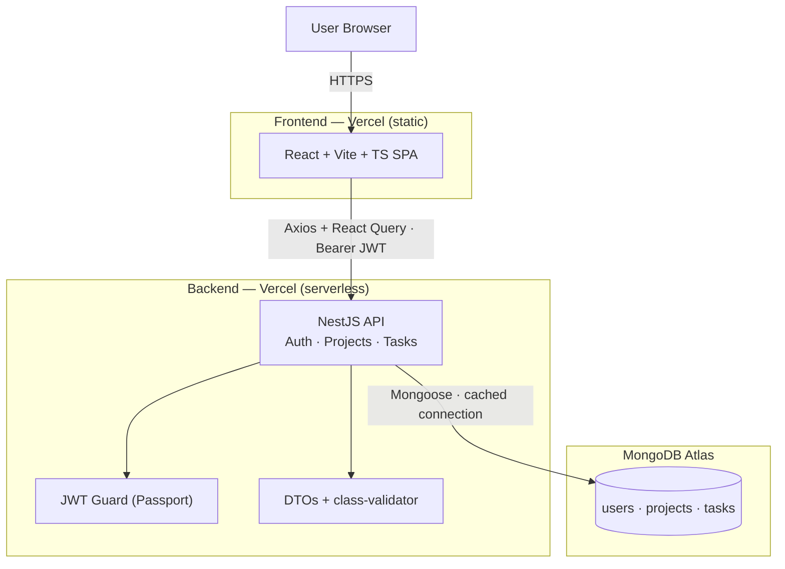

<div align="center">

# TeamBoard

**Work, Organized** — a lightweight platform for teams to manage projects and their tasks.

React + Vite · NestJS · MongoDB Atlas · TypeScript end-to-end

**Live:** [teamboard-web-amber.vercel.app](https://teamboard-web-amber.vercel.app) · API: [teamboard-api.vercel.app/api/health](https://teamboard-api.vercel.app/api/health)

</div>

---

TeamBoard is a small, focused full-stack application: sign up, create projects, break
each project into tasks, and move those tasks across a **To Do / In Progress / Done**
board. It's built as a **modular monolith with clean service seams** — deliberately
structured so any feature could be lifted into its own microservice later.

> This repository was built for a full-stack assessment. The emphasis, per the brief, is
> on **technical decisions, code organization, and system-design thinking** — so every
> non-obvious choice below is written down with the reasoning behind it, not just the
> outcome.

---

## Contents

- [Quick start](#quick-start)
- [Architecture overview](#architecture-overview)
- [Repository structure](#repository-structure)
- [API reference](#api-reference)
- [Tech stack](#tech-stack)
- [Design system](#design-system)
- [Testing](#testing)
- [Deployment](#deployment)
- [Docker](#docker)
- [Design decisions & trade-offs](#design-decisions--trade-offs)
- [Known limitations & next steps](#known-limitations--next-steps)

---

## Quick start

### Prerequisites
- **Node.js 20+** and npm 10+
- A **MongoDB Atlas** connection string (free M0 tier is fine)

### 1. Install
```bash
npm install
```
This installs all three workspaces (`shared`, `backend`, `frontend`) and builds the
shared types package automatically (its `prepare` script), so everything else can
import `@teamboard/shared`.

### 2. Configure environment
Create `backend/.env` (see `backend/.env.example`):
```env
MONGODB_URI=mongodb+srv://<user>:<password>@<cluster>.mongodb.net/teamboard?retryWrites=true&w=majority
JWT_SECRET=<a-long-random-secret>       # e.g. openssl rand -hex 32
JWT_EXPIRES_IN=7d
PORT=4000
CORS_ORIGIN=http://localhost:5173
```
Create `frontend/.env` (see `frontend/.env.example`):
```env
VITE_API_URL=http://localhost:4000/api
```

### 3. Run (two terminals)
```bash
npm run dev:backend     # NestJS API  → http://localhost:4000/api
npm run dev:frontend    # React SPA   → http://localhost:5173
```
Open **http://localhost:5173**, create an account, and start organizing.

### Other scripts
```bash
npm run build           # build shared → backend → frontend
npm run test:backend    # backend unit tests (Jest)
```

---

## Architecture overview



**Why a modular monolith (not microservices yet).** At this size, microservices would be
premature — network hops and ops overhead with no payoff. Instead the backend is one
deployable with **strict internal boundaries**: each feature is a NestJS module
(controller + service + DTOs + schema) that talks to others only through injected
services with typed contracts. Splitting `AuthService` / `ProjectService` /
`TaskService` into their own processes later becomes "replace an in-process call with a
network call behind the same interface" — the controllers don't change. That's the
brief's "structure that could evolve into microservices," implemented rather than
promised.

**Module boundaries:**
```
AuthModule ──uses──> UsersModule            (validate credentials, create users)
ProjectsModule ──owns──> projects           (scoped to req.user.id)
TasksModule ──imports──> ProjectsModule      (reuses its ownership check)
```
One-directional dependencies only — `TasksService` depends on `ProjectsService`'s
**public method**, never its internals. That's exactly the seam a REST/gRPC/queue call
would replace in a real split.

---

## Repository structure

```
teamboard/
├── backend/      NestJS API (auth, projects, tasks, config, common)
│   ├── src/{auth,users,projects,tasks,common,config}
│   ├── api/index.ts        serverless entry (Vercel)
│   ├── test/                Jest unit tests
│   ├── postman/              importable API collection
│   └── Dockerfile
├── frontend/     Vite + React SPA
│   ├── src/{features,components,services,lib,pages,styles}
│   └── Dockerfile
├── shared/       @teamboard/shared — types + enums used by both sides
├── docker-compose.yml
└── README.md
```

Both sides are **feature-first**: the backend has a module per feature, the frontend a
folder per feature (its API calls, hooks, and screens). Same mental model, both ends.
Inside `backend/src/<feature>/`, the pattern repeats every time: `*.controller.ts`
(routes) → `*.service.ts` (logic) → `dto/` (validated input) → `schemas/` (Mongoose
model) — understand one feature module and you understand all of them.

---

## API reference

All routes are prefixed with `/api`. Everything except signup/login/health requires an
`Authorization: Bearer <jwt>` header.

| Method | Endpoint | Description |
|---|---|---|
| `GET` | `/api/health` | Liveness check |
| `POST` | `/api/auth/signup` | Create account → `{ accessToken, user }` |
| `POST` | `/api/auth/login` | Log in → `{ accessToken, user }` |
| `GET` | `/api/auth/me` | Current user |
| `GET` | `/api/projects` | List my projects (with `taskCount`) |
| `POST` | `/api/projects` | Create project |
| `GET` | `/api/projects/:id` | Get one project |
| `PATCH` | `/api/projects/:id` | Update project |
| `DELETE` | `/api/projects/:id` | Delete project (+ its tasks) |
| `GET` | `/api/projects/:id/tasks` | List tasks in a project |
| `POST` | `/api/projects/:id/tasks` | Create task |
| `PATCH` | `/api/projects/:id/tasks/:taskId` | Update task / move status |
| `DELETE` | `/api/projects/:id/tasks/:taskId` | Delete task |
| `PATCH` | `/api/users/me` | Update display name / avatar (never email) |
| `DELETE` | `/api/users/me` | Delete account (password-confirmed, cascades) |

Import `backend/postman/TeamBoard.postman_collection.json` to try them all — it chains
the token and ids for you.

**Ownership is enforced in the service, not the URL.** `userId` always comes from the
verified JWT, never the request body. A project that's missing *or* not yours both
return `404` — the API never confirms an id exists for someone else.

---

## Tech stack

| Layer | Choice |
|---|---|
| Frontend | React 18, Vite, TypeScript, TanStack Query, React Router, react-hook-form + zod, Tailwind, Framer Motion |
| Backend | NestJS 11, TypeScript (strict), Mongoose, Passport-JWT, bcryptjs, class-validator, Joi |
| Database | MongoDB Atlas |
| Shared | `@teamboard/shared` — one set of TS contracts for both sides |
| Hosting | Vercel (static SPA + serverless API) |

---

## Design system

The UI isn't a generic SaaS theme — it's a cohesive **editorial "Ink & Patina"** language
derived from `/brand_identity`: a warm Fog/Bone canvas, Drafting-Ink text, and Verdigris
/ Brass / Slate used **only** for meaning (status, accents). Type is **Fraunces**
(display serif), **Geist** (UI), and **IBM Plex Mono** (labels). Motion is quiet —
scroll-reveal fade-ups and a board where task cards glide between columns using shared
layout animation. Tokens live once in `frontend/tailwind.config.ts`, so the whole UI
stays consistent and re-themable from one file.

---

## Testing

- **Unit tests** (`npm run test:backend`) cover the two highest-risk behaviours:
  credential handling in `AuthService` (hashing, duplicate email, login success/failure)
  and ownership enforcement in `TasksService`. `2 suites · 8 tests`.
- **Postman collection** exercises the full API end-to-end, chaining tokens and ids
  automatically.
- A scripted end-to-end run (health → signup → login → guards → validation →
  project/task CRUD → cross-user ownership `404` → cleanup) was executed against the
  live Atlas connection and passes, both locally and against the production deployment.

---

## Deployment

**Live now:** [teamboard-web-amber.vercel.app](https://teamboard-web-amber.vercel.app) (frontend) and
[teamboard-api.vercel.app](https://teamboard-api.vercel.app/api/health) (backend), both on
Vercel, both talking to the same MongoDB Atlas cluster.

> Note the `-amber` suffix on the frontend domain: the plain `teamboard-web.vercel.app`
> belongs to an unrelated project on a different Vercel account — the `*.vercel.app`
> subdomain namespace is global, not scoped per team, so ours was auto-suffixed to avoid
> the collision.

Two Vercel projects from this one repo (frontend static, backend serverless), each with
its Root Directory set to the app folder — Vercel's monorepo detection installs from the
true repo root (respecting npm workspaces) and builds within the subdirectory. The
backend runs as a single cached serverless function that **reuses its Mongoose
connection** across invocations, the detail that separates "works in a demo" from
"works under real traffic": without it, every cold start opens a fresh connection and
exhausts Atlas's pool.

<details>
<summary><strong>What actually went wrong getting this live</strong> (worth reading — none of it showed up until deploy)</summary>

Everything built cleanly and every test passed locally. On first deploy, every request
to the live API just hung — no response, no error, no log line. Four unrelated problems
were stacked on top of each other:

1. **Legacy `vercel.json` broke the monorepo install.** The original config used the
   old `builds`/`routes` array format, which skips Vercel's workspace-aware install
   entirely — so the local `@teamboard/shared` package couldn't resolve. Fixed by
   switching to a `rewrites`-only config, which lets Vercel's normal install path run.
2. **Vercel Deployment Protection silently blocked every request** — an SSO wall
   enabled by default on team accounts. Disabled in Project Settings.
3. **Atlas Network Access.** Serverless functions have dynamic, unpredictable outbound
   IPs; Atlas's allow-list didn't include them, so the connection attempt hung until
   the driver's own timeout. Fixed by allowing `0.0.0.0/0` (access is still gated by
   the DB credentials).
4. **Two compounding bugs, found by bisection** (deploying stripped-down diagnostic
   handlers that each tested one hypothesis, comparing which responded instantly vs.
   hung):
   - An env var had been set via `echo "value" | vercel env add KEY` — `echo` appends a
     trailing newline, so `NODE_ENV` was literally `"production\n"`. That failed Joi
     validation *inside* `ConfigModule.forRoot()`, an `async` call sitting directly in
     `AppModule`'s `imports` array — and the rejection never surfaced as a clean error,
     it just hung the whole bootstrap silently. Fixed by using `printf` instead of
     `echo` when piping env values, and widening the schema with `.unknown(true)` since
     hosting platforms inject their own vars (Vercel alone adds ~44 `AWS_*`/`VERCEL_*`
     keys) that a schema shouldn't reject.
   - `@nestjs/platform-express@11` depends on **Express 5**, but `backend/package.json`
     still pinned Express 4 from before an earlier framework upgrade. Bumped to
     `express@^5.2.1` with a root `npm overrides` entry so the whole tree deduped to one
     version.

None of this was found by reading a stack trace — there wasn't one. It was found by
isolating the smallest reproducible unit at each step (raw Mongoose connect only; Nest
context with just `ConfigModule`; direct Joi validation against real `process.env`; a
plain non-Nest handler) until each layer either confirmed or ruled itself out.

</details>

**Path B — always-on backend.** Serverless has cold starts and no long-running
processes. If TeamBoard ever needs websockets/queues/cron, the *same* NestJS code
deploys to Railway or Render as a persistent service (`npm run start:prod`) — only the
deploy target changes.

---

## Docker

A `docker-compose.yml` and per-app `Dockerfile`s are included (bonus per the brief) —
not part of the day-to-day workflow, which uses `npm run dev:backend` / `dev:frontend`
directly, but there if you want a containerized local run:

```bash
docker compose up --build
```

Both Dockerfiles build from the **repo root** (`context: .`) so the npm workspace can
resolve the sibling `shared` package — same reasoning as the Vercel monorepo setup
above. The frontend build takes `VITE_API_URL` and the Cloudinary vars as build
**args**, not runtime environment variables, since Vite inlines them at build time. This
still connects to MongoDB Atlas, not a local Mongo container — see the trade-off note
below on why Atlas was used as specified rather than swapped for a self-hosted database.

---

## Design decisions & trade-offs

- **MongoDB Atlas, unchanged.** The brief names MongoDB; no reason to spend design
  credit swapping it. *Trade-off:* relational-ish data in a document store → addressed by
  the next point.
- **Referenced, not embedded documents.** `Project.owner` and `Task.project` are
  `ObjectId` references so each collection stays independently queryable and splittable.
  *Trade-off:* project-with-tasks reads take two queries — bought back with one
  aggregation for task counts.
- **Own JWT auth.** bcrypt + Passport-JWT + a guard, built here — it's the most-evaluated
  surface. Login never reveals which accounts exist.
- **Token in `localStorage`.** Simplest correct cross-origin scheme for two separate
  Vercel apps. *Trade-off:* a small XSS-exposure surface; an `httpOnly` cookie is the
  hardening path if they ever share a domain (touches only two files).
- **Thin controllers, fat services.** All logic lives in services — the seam a
  microservice split would follow.
- **Shared TS contracts.** `@teamboard/shared` makes a contract change a compile error on
  both sides. (Consumed as built CJS by the backend, as TS source by Vite — one contract,
  two paths.)
- **Config validated at boot** with Joi — the app refuses to start on bad env, and fails
  loudly instead of hanging (see the Deployment section's post-mortem for what happens
  when that validation itself has a bug).
- **`bcryptjs` over native `bcrypt`** — same API, no C++ toolchain, builds anywhere.
- **Account deletion requires re-entering the password** — a destructive action gets a
  confirmation gate, and cascades every project/task the account owns rather than
  leaving orphaned data.

---

## Known limitations & next steps

- **No task drag-and-drop** — status moves via a one-click segmented control (with
  optimistic updates + layout animation). DnD (`@dnd-kit`) is a natural next step.
- **Single-user ownership** — no team sharing/roles yet; the data model (owner refs)
  leaves room for it.
- **`localStorage` token** — see the trade-off above; `httpOnly` cookies for hardening.
- **Frontend ships as one bundle** — fine for an internal tool; route-level code-splitting
  would trim first load if it grew.
- **Microservice split not performed** — the seams exist; the split is intentionally left
  as the "when the team is ready" step.

<div align="center">
<sub>Built with care — React · NestJS · MongoDB.</sub>
</div>
