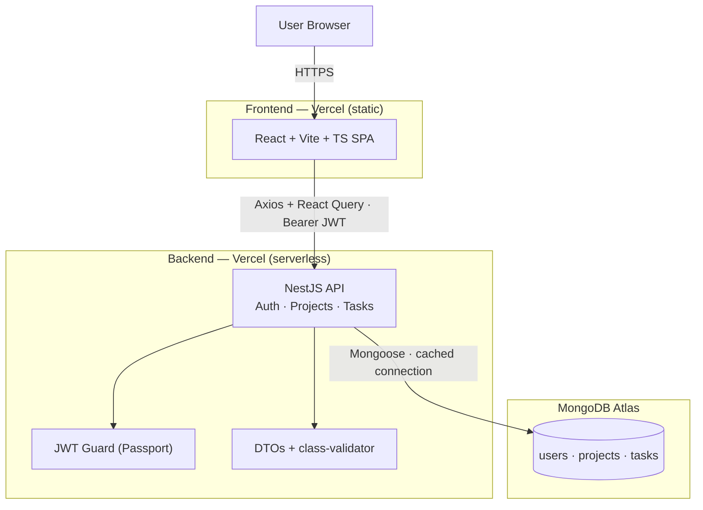

<div align="center">

# TeamBoard

**Work, Organized** — a lightweight platform for teams to manage projects and their tasks.

React + Vite · NestJS · MongoDB Atlas · TypeScript end-to-end

**Live:** [teamboard-web-amber.vercel.app](https://teamboard-web-amber.vercel.app) · API: [teamboard-api.vercel.app/api/health](https://teamboard-api.vercel.app/api/health)

</div>

---

TeamBoard is a small, focused full-stack application: sign up, create projects, break
each project into tasks, and move those tasks across a **To Do / In Progress / Done**
board. It's built as a **modular monolith with clean service seams** — deliberately
structured so any feature could be lifted into its own microservice later.

> This repository was built for a full-stack assessment. The emphasis, per the brief, is
> on **technical decisions, code organization, and system-design thinking** — so every
> non-obvious choice is written down, both here and as a numbered set of docs in
> [`/docs`](./docs). Start with [`docs/00-architecture.md`](./docs/00-architecture.md).

---

## Contents

- [Quick start](#quick-start)
- [Architecture overview](#architecture-overview)
- [Repository structure](#repository-structure)
- [API reference](#api-reference)
- [Tech stack](#tech-stack)
- [Design system](#design-system)
- [Testing](#testing)
- [Deployment](#deployment)
- [Design decisions & trade-offs](#design-decisions--trade-offs)
- [Documentation index](#documentation-index)
- [Known limitations & next steps](#known-limitations--next-steps)

---

## Quick start

### Prerequisites
- **Node.js 20+** and npm 10+
- A **MongoDB Atlas** connection string (free M0 tier is fine)

### 1. Install
```bash
npm install
```
This installs all three workspaces (`shared`, `backend`, `frontend`) and builds the
shared types package automatically (its `prepare` script), so everything else can
import `@teamboard/shared`.

### 2. Configure environment
Create `backend/.env` (see `backend/.env.example`):
```env
MONGODB_URI=mongodb+srv://<user>:<password>@<cluster>.mongodb.net/teamboard?retryWrites=true&w=majority
JWT_SECRET=<a-long-random-secret>       # e.g. openssl rand -hex 32
JWT_EXPIRES_IN=7d
PORT=4000
CORS_ORIGIN=http://localhost:5173
```
Create `frontend/.env` (see `frontend/.env.example`):
```env
VITE_API_URL=http://localhost:4000/api
```

### 3. Run (two terminals)
```bash
npm run dev:backend     # NestJS API  → http://localhost:4000/api
npm run dev:frontend    # React SPA   → http://localhost:5173
```
Open **http://localhost:5173**, create an account, and start organizing.

### Other scripts
```bash
npm run build           # build shared → backend → frontend
npm run test:backend    # backend unit tests (Jest)
```

---

## Architecture overview



**Why a modular monolith (not microservices yet).** At this size, microservices would be
premature — network hops and ops overhead with no payoff. Instead the backend is one
deployable with **strict internal boundaries**: each feature is a NestJS module
(controller + service + DTOs + schema) that talks to others only through injected
services with typed contracts. Splitting `AuthService` / `ProjectService` /
`TaskService` into their own processes later becomes "replace an in-process call with a
network call behind the same interface" — the controllers don't change. That's the
brief's "structure that could evolve into microservices," implemented rather than
promised. Full reasoning: [`docs/00`](./docs/00-architecture.md).

---

## Repository structure

```
teamboard/
├── backend/      NestJS API (auth, projects, tasks, config, common)
│   ├── src/{auth,users,projects,tasks,common,config}
│   ├── api/index.ts        serverless entry (Vercel)
│   ├── test/               Jest unit tests
│   └── postman/            importable API collection
├── frontend/     Vite + React SPA
│   └── src/{features,components,services,lib,pages,styles}
├── shared/       @teamboard/shared — types + enums used by both sides
├── docs/         one numbered document per milestone (00 → 10)
└── README.md
```

Both sides are **feature-first**: the backend has a module per feature, the frontend a
folder per feature (its API calls, hooks, and screens). Same mental model, both ends.

---

## API reference

All routes are prefixed with `/api`. Everything except signup/login/health requires an
`Authorization: Bearer <jwt>` header.

| Method | Endpoint | Description |
|---|---|---|
| `GET` | `/api/health` | Liveness check |
| `POST` | `/api/auth/signup` | Create account → `{ accessToken, user }` |
| `POST` | `/api/auth/login` | Log in → `{ accessToken, user }` |
| `GET` | `/api/auth/me` | Current user |
| `GET` | `/api/projects` | List my projects (with `taskCount`) |
| `POST` | `/api/projects` | Create project |
| `GET` | `/api/projects/:id` | Get one project |
| `PATCH` | `/api/projects/:id` | Update project |
| `DELETE` | `/api/projects/:id` | Delete project (+ its tasks) |
| `GET` | `/api/projects/:id/tasks` | List tasks in a project |
| `POST` | `/api/projects/:id/tasks` | Create task |
| `PATCH` | `/api/projects/:id/tasks/:taskId` | Update task / move status |
| `DELETE` | `/api/projects/:id/tasks/:taskId` | Delete task |

Import `backend/postman/TeamBoard.postman_collection.json` to try them all — it chains
the token and ids for you.

---

## Tech stack

| Layer | Choice |
|---|---|
| Frontend | React 18, Vite, TypeScript, TanStack Query, React Router, react-hook-form + zod, Tailwind, Framer Motion |
| Backend | NestJS 10, TypeScript (strict), Mongoose, Passport-JWT, bcryptjs, class-validator, Joi |
| Database | MongoDB Atlas |
| Shared | `@teamboard/shared` — one set of TS contracts for both sides |
| Hosting | Vercel (static SPA + serverless API) |

---

## Design system

The UI isn't a generic SaaS theme — it's a cohesive **editorial "Ink & Patina"** language
derived from `/brand_identity`: a warm Fog/Bone canvas, Drafting-Ink text, and Verdigris
/ Brass / Slate used **only** for meaning (status, accents). Type is **Fraunces**
(display serif), **Geist** (UI), and **IBM Plex Mono** (labels). Motion is quiet —
scroll-reveal fade-ups and a board where task cards glide between columns. Tokens live
once in `frontend/tailwind.config.ts`. See [`docs/05`](./docs/05-frontend-scaffold.md).

---

## Testing

- **Unit tests** (`npm run test:backend`) cover the two highest-risk behaviours:
  credential handling in `AuthService` (hashing, duplicate email, login success/failure)
  and ownership enforcement in `TasksService`. `2 suites · 8 tests`.
- **Postman collection** exercises the full API end-to-end.
- During the build, a scripted end-to-end run (health → signup → login → guards →
  validation → project/task CRUD → cross-user ownership `404` → cleanup) was executed
  against a live Atlas connection and passes. See [`docs/08`](./docs/08-testing-postman.md).

---

## Deployment

**Live now:** [teamboard-web-amber.vercel.app](https://teamboard-web-amber.vercel.app) (frontend) and
[teamboard-api.vercel.app](https://teamboard-api.vercel.app/api/health) (backend), both on
Vercel, both talking to the same MongoDB Atlas cluster.

> Note the `-amber` suffix on the frontend domain: the plain `teamboard-web.vercel.app`
> is an unrelated project owned by a different Vercel account — Vercel's `*.vercel.app`
> subdomain namespace is global, not scoped per team, so ours was auto-suffixed to avoid
> the collision.

Two Vercel projects from this one repo (frontend static, backend serverless) plus Atlas.
The backend runs as a single cached serverless function that **reuses its Mongoose
connection** across invocations — the key to not exhausting Atlas under serverless
traffic. Full procedure, the always-on "Path B" (Railway/Render) alternative, and the
real gotchas hit getting this live (Express major-version mismatch, env-var newline
corruption from shell piping, Vercel Deployment Protection, Atlas Network Access):
[`docs/09`](./docs/09-deployment.md).

---

## Design decisions & trade-offs

A condensed ADR log (the long form is in [`docs/00`](./docs/00-architecture.md)):

- **MongoDB Atlas, unchanged.** The brief names MongoDB; no reason to spend design
  credit swapping it. *Trade-off:* relational-ish data in a document store → addressed by
  the next point.
- **Referenced, not embedded documents.** `Project.owner` and `Task.project` are
  `ObjectId` references so each collection stays independently queryable and splittable.
  *Trade-off:* project-with-tasks reads take two queries — bought back with one
  aggregation for task counts.
- **Own JWT auth.** bcrypt + Passport-JWT + a guard, built here — it's the most-evaluated
  surface. Login never reveals which accounts exist.
- **Token in `localStorage`.** Simplest correct cross-origin scheme for two separate
  Vercel apps. *Trade-off:* a small XSS-exposure surface; an `httpOnly` cookie is the
  hardening path if they ever share a domain (touches only two files).
- **Thin controllers, fat services.** All logic lives in services — the seam a
  microservice split would follow.
- **Shared TS contracts.** `@teamboard/shared` makes a contract change a compile error on
  both sides. (Consumed as built CJS by the backend, as TS source by Vite — one contract,
  two paths.)
- **Config validated at boot** with Joi — the app refuses to start on bad env.
- **`bcryptjs` over native `bcrypt`** — same API, no C++ toolchain, builds anywhere.

---

## Documentation index

| # | Doc | Covers |
|---|---|---|
| 00 | [Architecture & Design System](./docs/00-architecture.md) | decisions, stack, design language |
| 01 | [Repo & Environment Setup](./docs/01-repo-setup.md) | monorepo, workspaces, config |
| 02 | [Database Schemas](./docs/02-database-schemas.md) | User/Project/Task, references |
| 03 | [Backend — Auth](./docs/03-backend-auth.md) | signup/login, JWT, bcrypt |
| 04 | [Backend — Projects & Tasks](./docs/04-backend-projects-tasks.md) | CRUD, ownership, DTOs |
| 05 | [Frontend — Scaffold & Design](./docs/05-frontend-scaffold.md) | routing, React Query, tokens |
| 06 | [Frontend — Auth Flow](./docs/06-frontend-auth.md) | forms, token storage, guards |
| 07 | [Frontend — Projects & Tasks UI](./docs/07-frontend-projects-tasks.md) | the board experience |
| 08 | [Testing & Postman](./docs/08-testing-postman.md) | unit tests, API collection |
| 09 | [Deployment](./docs/09-deployment.md) | Vercel + Atlas, connection caching |
| 10 | [README & Demo Script](./docs/10-readme-demo.md) | the hand-off walkthrough |

---

## Known limitations & next steps

- **No task drag-and-drop** — status moves via a one-click segmented control (with
  optimistic updates + layout animation). DnD (`@dnd-kit`) is a natural next step.
- **Single-user ownership** — no team sharing/roles yet; the data model (owner refs)
  leaves room for it.
- **`localStorage` token** — see the trade-off above; `httpOnly` cookies for hardening.
- **Frontend ships as one bundle** — fine for an internal tool; route-level code-splitting
  would trim first load if it grew.
- **Microservice split not performed** — the seams exist; the split is intentionally left
  as the documented "when the team is ready" step.

<div align="center">
<sub>Built with care — React · NestJS · MongoDB.</sub>
</div>
