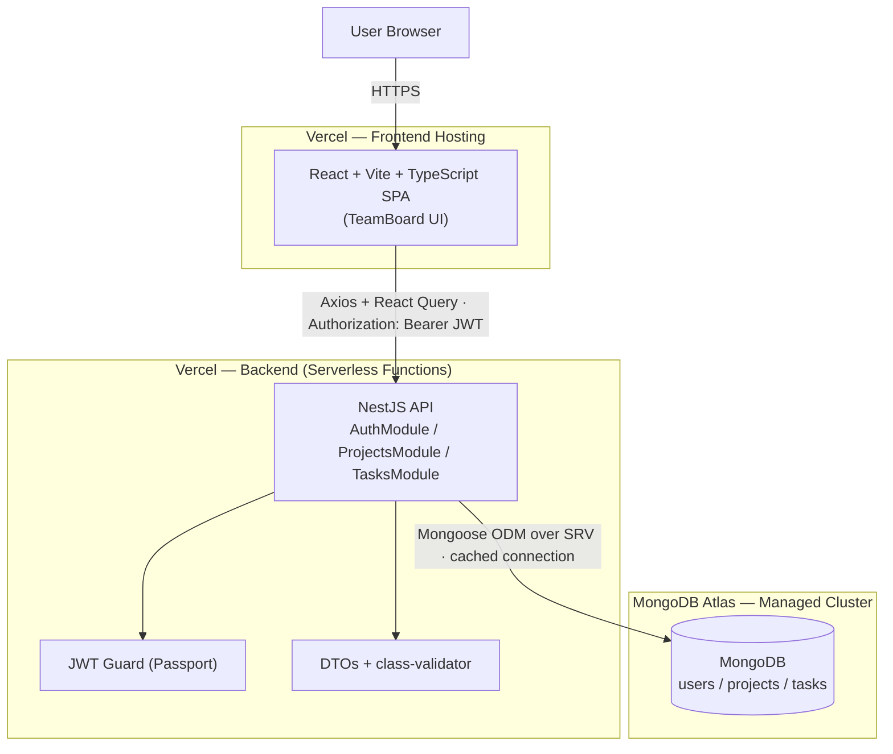

# 00 — Architecture & Design System

> **Read this first.** It is the map for everything else in `/docs`. Every later
> document (`01` … `10`) implements one slice of what is decided here.

**Project:** TeamBoard — a lightweight work-management platform (projects → tasks).
**Assessment:** Full-Stack Code Assessment — React + NestJS + MongoDB.
**Author:** Abakwe Carrington (CyberSage).

---

## 1. What is actually being evaluated

The brief says it plainly:

> *"The focus is on your technical decisions, code organization, and system design
> thinking, not just on the number of features completed."*

So this repository is graded on **judgement**, not feature count. Concretely:

| Grading signal (from the brief) | Where we answer it |
|---|---|
| Can you justify your architecture? | This doc + the README "reasoning" section |
| Is it modular enough to become microservices? | §5 module boundaries, per-module NestJS structure |
| DTOs, validation, env config, separation of concerns | `03`, `04` — DTOs + `ValidationPipe`, `ConfigModule`, thin controllers |
| Bonus: Docker, shared TS types, tests, deploy | `shared/` package, `08` tests + Postman, `09` deploy |

Every decision below is written as a small **ADR** (Architecture Decision Record):
*we chose X over Y because Z.* That paper trail is the point.

---

## 2. System at a glance



The data flow is deliberately boring and one-directional: the SPA holds no business
rules, the API owns every rule and every write, MongoDB is the only source of truth.

---

## 3. Stack decisions

| Layer | Brief says | We use | One-line reason |
|---|---|---|---|
| Frontend | React | React 18 + **Vite** + **TypeScript** | Fast HMR, type-safety end-to-end |
| Styling | *(clean UI)* | **Tailwind v3** + brand tokens + Framer Motion | Design tokens in one config, motion for polish |
| Data fetching | *your choice* | **TanStack Query (React Query)** | Cache, refetch, loading/error states for free |
| Backend | NestJS | **NestJS 10** + TypeScript (strict) | As specified; DI + modules map to microservices |
| ODM | Mongoose | **@nestjs/mongoose** | Native fit; schemas map straight to documents |
| Database | MongoDB | **MongoDB Atlas** (managed) | Literal to the brief; live dashboard for the demo |
| Auth | JWT recommended | **Own** JWT — Passport + bcrypt | The assessment wants to see *us* build auth |
| Shared types | bonus | **`@teamboard/shared`** workspace package | One source of truth for FE ↔ BE contracts |
| Hosting | not specified | Vercel (FE) + Vercel serverless (BE) | One dashboard, git-push deploys |

---

## 4. Architecture Decision Records

### ADR-001 — MongoDB Atlas, not a swapped database
The brief names MongoDB. We spend zero "freedom" credit arguing with the one piece
of stack they fixed. Atlas is the official managed service: free M0 tier, native
Mongoose fit, a dashboard the client can watch live during the demo.
**Trade-off:** `User → Project → Task` is relational data in a document store — see ADR-002.

### ADR-002 — Referenced documents, not embedded
`Project.owner` and `Task.project` are stored as `ObjectId` **references**, not
embedded sub-documents. Embedding tasks inside a project would be faster to write
but would fuse two collections that must stay independently queryable and paginated —
and, later, independently splittable into `ProjectService` / `TaskService`.
Referencing is the concrete implementation of the brief's "could evolve into
microservices" line.

### ADR-003 — We build the JWT auth ourselves
`AuthModule` owns bcrypt password hashing, a Passport JWT strategy, and a
`JwtAuthGuard`. No hosted auth provider. This is the single most-evaluated surface,
so there are no shortcuts here. **JWT carries identity; guards decide authority.**

### ADR-004 — Token in `localStorage` + `Authorization` header
Frontend and backend are different origins (two Vercel projects), so a Bearer token
in an `Authorization` header is the simplest correct cross-origin scheme, and it
matches the architecture diagram. **Trade-off (stated honestly):** `localStorage` is
readable by injected scripts, so it trades a small XSS-exposure surface for cross-origin
simplicity. An `httpOnly` cookie is the hardening path if the two ever share a domain.

### ADR-005 — Thin controllers, fat services
Controllers only parse/validate the request (via DTOs) and shape the response.
All business logic — ownership checks, hashing, status transitions — lives in
`*.service.ts`. This is the brief's "separation of business logic and controllers"
made literal, and it is what makes a module liftable into its own service.

### ADR-006 — Config validated at boot (12-factor)
Secrets never live in code. `ConfigModule` loads `.env` and a **Joi schema** rejects
boot if `MONGODB_URI` or `JWT_SECRET` is missing/short. Fail fast, fail loud.

### ADR-007 — Shared TypeScript contracts
`@teamboard/shared` exports the `User`/`Project`/`Task` interfaces, the `TaskStatus`
enum, and the auth response shapes. Backend DTOs and frontend API calls both import
them, so a contract change is a compile error on both sides, not a runtime surprise.

### ADR-008 — Serverless backend, with a named escape hatch
The Nest app is wrapped as one Vercel Function (`api/index.ts`). **Trade-off:** cold
starts + no long-running processes. If we ever need websockets/queues/cron, **Path B**
is Railway/Render with the *same* Nest code and a different deploy target — documented
in `09`.

---

## 5. Module boundaries → microservices

The backend is a **modular monolith**. Each feature is a self-contained NestJS module
with its own controller, service, and DTOs, talking to others only through injected
services — never by reaching into another module's internals.

```
AuthModule ──uses──> UsersModule            (validate credentials, create users)
ProjectsModule ──owns──> projects           (scoped to req.user.id)
TasksModule ──owns──> tasks                  (scoped to a project the user owns)
```

Because the seams are already services with typed contracts, "split into microservices"
becomes: replace an in-process `this.usersService.findByEmail()` with a network call
(REST/gRPC/message-queue) behind the *same interface*. Nothing in the controllers
changes. That is the whole point of building it this way now.

---

## 6. Design system — "Ink & Patina"

The brief asks for a clean, functional interface. We go further: a cohesive
**editorial, premium** language derived directly from `/brand_identity`. It blends
two internal design skills — *Editorial Luxury* (high-end) and *Premium Utilitarian
Minimalism* (minimalist-ui): warm material canvas, high-contrast serif display,
scarce and meaningful colour.

### Palette (from `TeamBoard-Color-Palette.svg`)

| Token | Hex | Role |
|---|---|---|
| Drafting Ink | `#121A22` | Primary text, primary buttons |
| Slate | `#26323C` | Dark surface, secondary text, `TODO` status |
| Verdigris | `#4C8577` | Primary accent, `DONE` status |
| Brass | `#B4915B` | CTA / highlight, `IN-PROGRESS` status |
| Fog | `#E9E6DE` | App background |
| Bone | `#F5F3ED` | Card surface |

Colour is a **scarce resource** — used only for meaning (status, accent), never as
decoration. Backgrounds stay warm-neutral.

### Type

| Family | Use |
|---|---|
| **Fraunces** (variable serif) | Display headings, numerals — high optical contrast, tight tracking |
| **Geist** (grotesk sans) | Body, UI, buttons |
| **IBM Plex Mono** | Labels, metadata, status chips, keystrokes — the "ledger" voice |

### Rules we hold to
- No banned fonts (Inter/Roboto/Arial). No gradients-as-decoration, no neon, no
  heavy `shadow-lg`. Shadows are near-invisible (`< 0.06` opacity) or absent.
- **Macro-whitespace:** sections breathe (`py-24`+). Content width capped for reading.
- **Motion is quiet:** scroll-reveal fade-ups on `IntersectionObserver`/Framer Motion,
  `transform`/`opacity` only, custom cubic-bezier easings — never `linear`.
- **Icons:** Phosphor (light/regular weights), never thick default Lucide/Material.
- A single fixed film-grain overlay gives the "paper" feel without hurting scroll perf.

The tokens live once in `frontend/tailwind.config.ts` and `frontend/src/styles/theme.css`,
so the whole UI stays consistent and re-themable.

---

## 7. Repository map

```
teamboard/
├── backend/     NestJS API — auth, projects, tasks, config, common
├── frontend/    Vite + React SPA — features, components, services, design system
├── shared/      @teamboard/shared — types + enums used by both sides
├── docs/        one numbered document per milestone (you are in 00)
└── README.md    the front door — setup, architecture, trade-offs
```

---

## 8. How to read `/docs`

| # | Doc | What it covers |
|---|---|---|
| 00 | Architecture & Design System | *(this file)* decisions, stack, design language |
| 01 | Repo & Environment Setup | monorepo, workspaces, env validation |
| 02 | Database Schemas | User/Project/Task Mongoose models, references |
| 03 | Backend — Auth Module | signup/login, bcrypt, JWT, guards |
| 04 | Backend — Projects & Tasks | CRUD, ownership scoping, DTOs |
| 05 | Frontend — Scaffold & Design System | routing, React Query, tokens |
| 06 | Frontend — Auth Flow | forms, token storage, protected routes |
| 07 | Frontend — Projects & Tasks UI | the editorial board experience |
| 08 | Testing & Postman | unit tests, API collection |
| 09 | Deployment | Vercel + Atlas, connection caching |
| 10 | README & Demo Script | final hand-off narrative |

Read them in order for the full story; jump to one for a specific subsystem.
