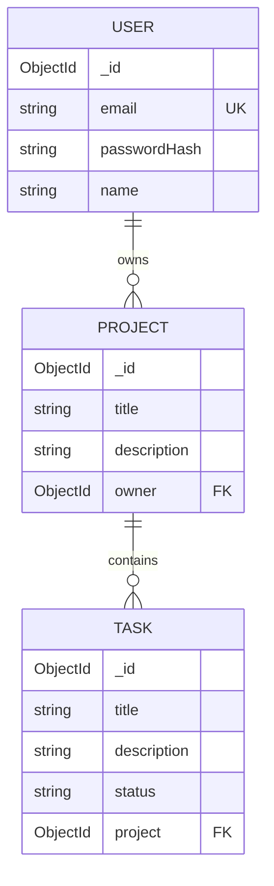

# 02 — Database Schemas (Mongoose + Atlas)

> **Milestone M2.** Defines the three collections and connects the app to MongoDB
> Atlas. This is where the one genuinely MongoDB-specific design call lives.

---

## 1. The three collections

| Collection | Fields | Relationships |
|---|---|---|
| `users` | `email` (unique), `passwordHash`, `name`, timestamps | — |
| `projects` | `title`, `description?`, `owner`, timestamps | `owner → users._id` |
| `tasks` | `title`, `description?`, `status`, `project`, timestamps | `project → projects._id` |



## 2. The key decision — referenced, not embedded (ADR-002)

MongoDB tempts you to embed tasks *inside* a project document. We deliberately don't.
`Project.owner` and `Task.project` are **`ObjectId` references**:

```ts
@Prop({ type: MongooseSchema.Types.ObjectId, ref: 'Project', required: true, index: true })
project!: Types.ObjectId;
```

**Why referencing wins here:**
- Tasks stay independently queryable and paginable (`find({ project })`, filter by
  status) without loading a whole project document.
- Each collection can later move to its own microservice with its own database — the
  reference becomes a cross-service id, not a broken embedded blob (docs/00 · §5).
- No 16 MB document-size ceiling risk as a project accumulates tasks.

**The honest trade-off:** reads that need a project *and* its tasks take two queries
(or a `$lookup`) instead of one. At this scale that is a non-issue, and we buy back
some of it with a single aggregation for task counts (docs/04).

## 3. Schema craftsmanship

- **`timestamps: true`** on all three → automatic `createdAt` / `updatedAt`.
- **Indexes** on `email` (unique), `owner`, `project`, and `status` — the fields we
  actually filter by.
- **`status`** reuses the shared `TaskStatus` enum (docs/01), so the DB constraint,
  the DTO validation, and the UI dropdown can never drift apart.
- **`toJSON` transforms** on every schema:
  - map `_id → id` and stringify `ObjectId` refs (clean API shape, no `_id`/`__v`),
  - and, on `User`, **always delete `passwordHash`** — the hash physically cannot
    leave the API even if a service returns a raw document by mistake.

## 4. Connecting to Atlas

`MongooseModule.forRootAsync` pulls the connection string from validated config —
never a hard-coded URI:

```ts
MongooseModule.forRootAsync({
  inject: [ConfigService],
  useFactory: (config) => ({ uri: config.get('mongodbUri') }),
});
```

Under serverless the same connection is **reused across invocations** rather than
reopened per request (docs/09 §5) — the detail that keeps Atlas's connection pool
from being exhausted.

## 5. Where the code lives

Schemas are **co-located with their feature module** (`users/schemas`,
`projects/schemas`, `tasks/schemas`) rather than in one central `schemas/` folder.
Each module owns its data definition — the cleanest starting point for extracting a
module into a standalone service later.
