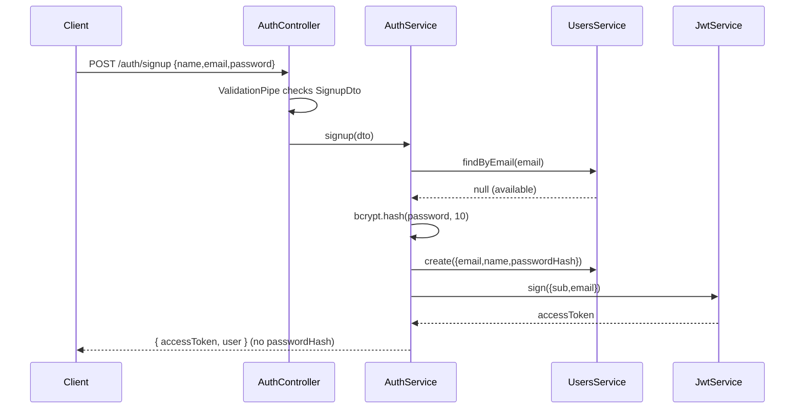

# 03 — Backend: Auth Module

> **Milestone M3.** The most-evaluated surface in the whole assessment. We build JWT
> auth ourselves — bcrypt hashing, a Passport strategy, and a guard — against our own
> `users` collection (docs/00 · ADR-003).

---

## 1. Endpoints

| Method | Path | Guard | Returns |
|---|---|---|---|
| `POST` | `/api/auth/signup` | — | `201 { accessToken, user }` |
| `POST` | `/api/auth/login` | — | `200 { accessToken, user }` |
| `GET` | `/api/auth/me` | JWT | `200 user` |

## 2. The flow



## 3. Design points worth reading aloud

**Passwords are never stored in plaintext (ADR-003).** `bcrypt.hash(password, 10)`
on signup; `bcrypt.compare` on login. We use **`bcryptjs`** (pure-JS) rather than the
native `bcrypt` so the project builds on any machine with no C++ toolchain — same API,
zero node-gyp risk.

**Login never leaks which accounts exist.** Unknown email and wrong password return the
*same* `401 Invalid email or password.` message.

**The password hash physically cannot escape.** The `User` schema's `toJSON` transform
deletes `passwordHash`, so every serialised user — signup response, `/me`, anywhere — is
already clean.

**JWT carries identity, guards decide authority.** `JwtStrategy` verifies the
`Bearer` token against `JWT_SECRET` and returns `{ id, email }` as `req.user`.
`JwtAuthGuard` (`@UseGuards`) is what actually gates a route. The token says *who you
are*; the guard + service ownership checks say *what you may touch*.

**Thin controller, fat service (ADR-005).** `AuthController` only maps HTTP ↔ DTO ↔
service call. All logic (hashing, duplicate checks, token issuance) lives in
`AuthService`. That is what makes the module liftable into a standalone `AuthService`
microservice later.

**DTOs validate at the edge.** `SignupDto`/`LoginDto` use `class-validator`
(`@IsEmail`, `@MinLength(8)`, `@MaxLength(72)` — bcrypt's byte cap) and `implement`
the shared payload types, so the wire contract is enforced in one place.

## 4. Files

```
auth/
├── dto/signup.dto.ts        email/password/name validation
├── dto/login.dto.ts
├── strategies/jwt.strategy.ts   verify Bearer token -> req.user
├── guards/jwt-auth.guard.ts     @UseGuards(JwtAuthGuard)
├── auth.service.ts          hashing, credential check, token issuance
├── auth.controller.ts       3 thin endpoints
└── auth.module.ts           wires Users + Passport + Jwt
```
