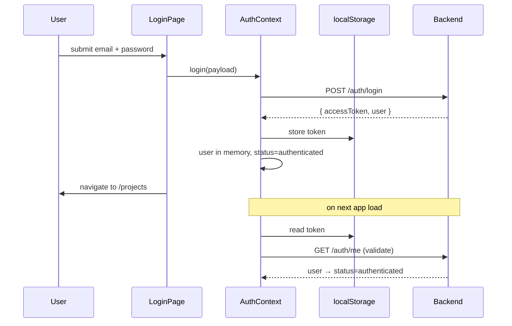

# 06 — Frontend: Auth Flow

> **Milestone M6.** Login, signup, session persistence, protected routes, and the
> honest trade-off behind where we keep the token.

---

## 1. The pieces

| File | Responsibility |
|---|---|
| `services/api.ts` | axios instance; attach Bearer token; handle 401 |
| `features/auth/AuthContext.tsx` | session state, login/signup/logout, hydration |
| `components/ProtectedRoute.tsx` | gate protected routes |
| `features/auth/AuthLayout.tsx` | the editorial split-screen shell |
| `features/auth/LoginPage.tsx`, `SignupPage.tsx` | the forms |

## 2. Token lifecycle

- **`api.ts`** attaches `Authorization: Bearer <token>` to every request via a request
  interceptor, and a response interceptor catches any `401`: it clears the token and
  calls the handler `AuthContext` registered — a one-line path to a clean logout from
  anywhere in the app.
- **`AuthContext`** holds `status: 'loading' | 'authenticated' | 'unauthenticated'`.
  On mount it validates any stored token against `/auth/me`, so a refresh restores the
  session (or silently logs out if the token expired).

## 3. Protected routes

`ProtectedRoute` reads `status`:
- `loading` → a full-screen loader (avoids a flash of the login page on refresh),
- `unauthenticated` → `<Navigate to="/login">`, remembering the intended path so the
  user lands back where they were headed,
- otherwise → renders the app.

The login/signup pages do the reverse: if already authenticated, they redirect to
`/projects`.

## 4. Forms

`react-hook-form` + `zod` (`zodResolver`) validate on the client — valid email, a
non-empty password on login, an 8-char minimum on signup — mirroring the backend DTO
rules so users get instant feedback, while the server stays the real authority. Server
errors (e.g. duplicate email, bad credentials) surface in an inline `ErrorState` using
`apiErrorMessage`, which reads the shared `ApiError` shape.

## 5. The trade-off (stated honestly)

We store the JWT in **`localStorage`** (ADR-004). Frontend and backend are separate
origins, so a Bearer header is the simplest correct cross-origin scheme. The cost:
`localStorage` is readable by injected scripts, so it carries a small XSS-exposure
surface. If the two ever shared a domain, an **`httpOnly` cookie** would be the
hardening move — the backend and this layer are structured so that swap touches only
`api.ts` and `AuthContext`, nothing else.
